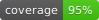

# parcels-web-app


This is django web application with which you can look for building plots advertisements and find the most attractive one.

### Design goals

Main goal of this application is collect data from services with advertisements and filter it with particular parameters.

Data is automatically scraped and loaded to database.

Application have features such us:
* saving filtered adverts
* searching adverts by description
* downloading csv file with favourite adverts
* sending email with csv file with saved adverts

### Dependencies
* Django
* PostresSQL
* Scrapy
* Celery

### Example Views


### Running on development server

Clone the repository:
```bash
git clone https://github.com/konradkrasno/parcels-web-app.git
cd parcels-web-app
```
Add .env:
```
parcels-web-app/.env
{
    SECRET_KEY=<your-secret-key>
    EMAIL_HOST=<your-email-host>
    EMAIL_USERNAME=<your-email-username>
    EMAIL_PASSWORD=<your-email-password>
    EMAIL_PORT=<your-email-port>
    DATABASE_NAME=<datababase-name>
    DATABASE_USER=<datababase-user>
    DATABASE_PASSWORD=<datababase-password>
    DATABASE_HOST=<datababase-host>
    REDIS_URL=<redis-url>
    DEBUG=1
}
```

Initialize docker containers:
```bash
docker-compose up -d
```

Running tests:

```bash
docker exec -it web bash
pytest
```
